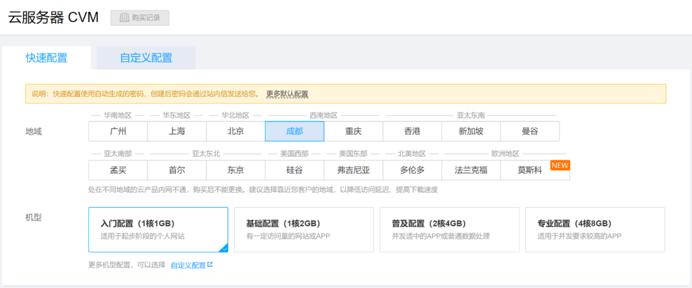
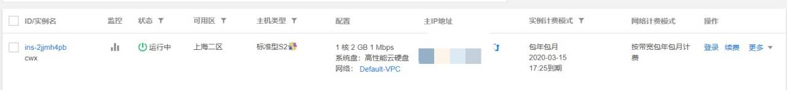
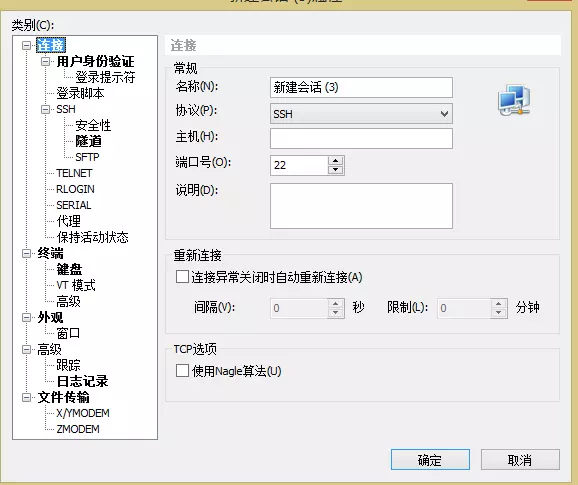
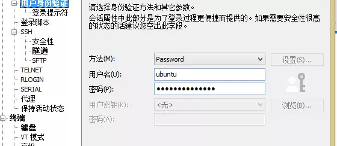
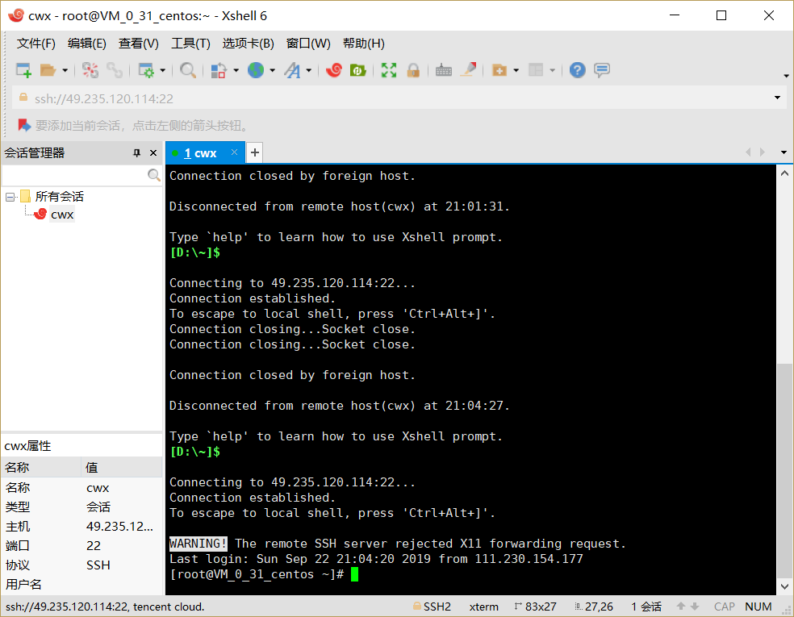

# 腾讯云学生服务器购买

**1.腾讯云学生服务器链接**  [https://cloud.tencent.com/act/campus](https://cloud.tencent.com/act/cps/redirect?redirect=10004&cps_key=926cbf665559b546f00b6d68613668ee&from=10680)

套餐包含特价云服务器、域名(可选)、50G免费对象存储空间（6个月）；每日限量100个，每个用户限购1个，并赠送2次体验价续费机会，优惠续费需在本页面进行。

2.购买成功后进入控制台查看实例，复制公网IP与root密码，用于SSH连接

# 搭建腾讯云，用Xshell建立连接

1.打开xshell，新建一个会话。

2.然后点击用户身份验证   用户名和密码写你登录云服务器的帐号密码。

3.然后在会话中点击连接，连接成功

