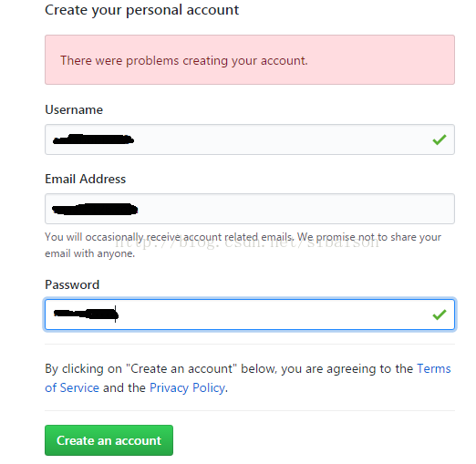
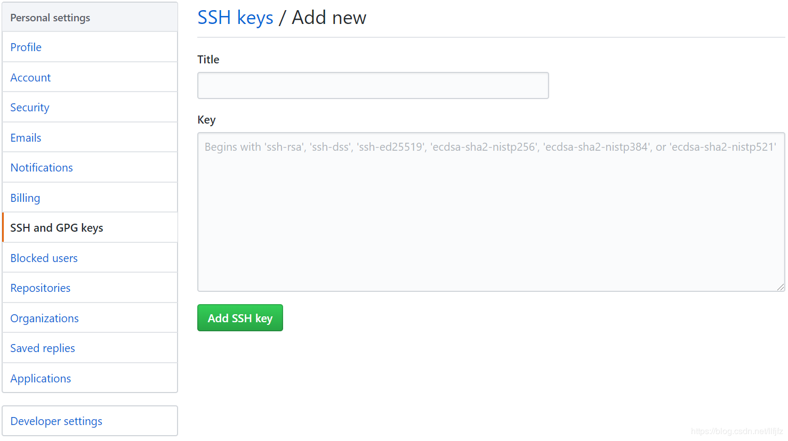
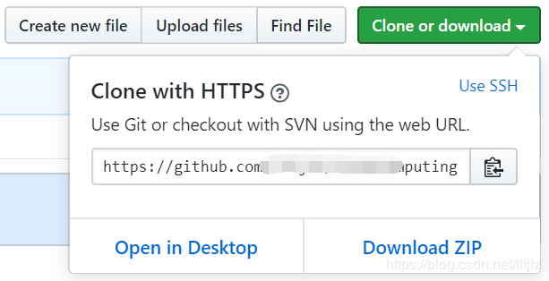

# 创建GitHub项目并在本地同步

## 一.注册GitHub账号：https://github.com/ 

1.进入GitHub官网，注册github账号

## 二.在GitHub上创建云计算项目（CloudComputing）并在 本地同步 

### 1、 Git与GitHub的简单介绍

Git是一个开源的分布式版本控制工具。 
GitHub是一个使用Git作为版本控制的项目托管平台，它是一个网站。 
详细请参考：http://www.cnblogs.com/cocowool/archive/2012/02/17/2356125.html

## **2、 Git的安装**

下载地址：https://git-scm.com/download/win 或 https://git-for-windows.github.io/ 
安装时，全部默认选择即可。

### 3.创建SSH Key

使用Git Bash进行命令行操作，首先要拥有一份ssh key进行身份验证。详细信息参见：Connecting to GitHub with SSH。

1.验证是否存在ssh keys
l<u>s -al ~/.ssh</u>

默认情况下生成的ssh key放置于“C:\Users\UserName”下的.ssh文件夹中，该命令列出该文件夹下包含的文件。常见的ssh密钥文件可能是以下文件之一：

id_dsa.pub
id_ecdsa.pub
id_ed25519.pub
id_rsa.pub
2.创建新的ssh key
如果不存在ssh密钥，则新建一个：
<u>ssh-keygen -t rsa -b 4096 -C “your_email@example.com”</u>

your_email@example.com替换成你的Github邮箱地址。随后会让你键入想要保存的ssh key的文件名

Enter a file in which to save the key

这里注意，建议不输入任何文件名，直接回车，这样就使用系统默认的设置。那么

随后复制“id_rsa.pub”的内容到GitHub网站的Settings–>SSH and GPG keys中：

设置title（任意），并将“id_rsa.pub”的内容复制到“Key”之中。

3.测试SSH Key是否配置成功：

<u>ssh -T git@github.com</u>

### 3.配置GitHub的用户名和邮箱

[配置用户名](https://help.github.com/en/articles/setting-your-username-in-git)

> git config --global user.name “your name”

"your name"替换成你的GitHub用户名。

[配置邮箱](https://help.github.com/en/articles/setting-your-commit-email-address)

> git config --global user.email “email@example.com

### 4.创建本地代码仓库

1.初始化本地文件夹作为一个Git仓库：
<u>git init</u>

2.拷贝GitHub网站中的项目网址：

3.添加远程代码仓库的URL：
<u>git remote add origin remote_repository_URL</u>

remote_repository_URL替换为刚才拷贝的项目的URL。说明，origin指代远程代码仓库（GitHub中），master表示本地的主分支。验证一下添加是否成功：

<u>git remote -v</u>

4.首先从远程代码仓库拉取数据
<u>git pull origin master</u>

5.新建README文档，README文档是每个GitHub项目必备，说明项目内容。上文没有创建，在此处完成。
<u>touch README.md</u>

6.添加文件夹中的所有文件：
<u>git add .</u>

7.提交文件：
<u>git commit -m “First commit”</u>

注意commit只在本地提交，并未同步到远程服务器。

推送本地更新至远程服务器：
git push -u origin master
