# **<u>本地安装VMware Workstation和CentOS系统</u>**

------

## 一.安装VMware

1.进入官网进行安装

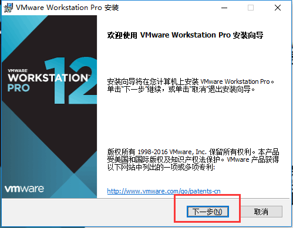

## 二.安装CentOS操作系统

1.进入VM，点击新建虚拟机

!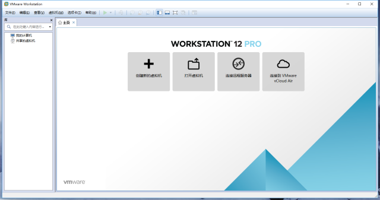

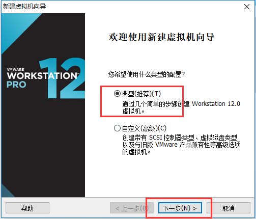

2.如图操作，选择Linux、CentOS64

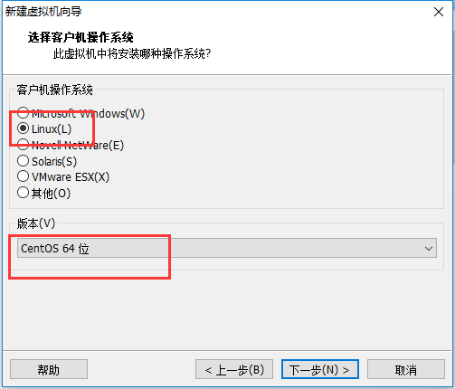

3.如图操作，设置“虚拟机名称”、“位置”，建议不要用中文名称，安装路径不要有中文、不要安装在C盘系统盘。

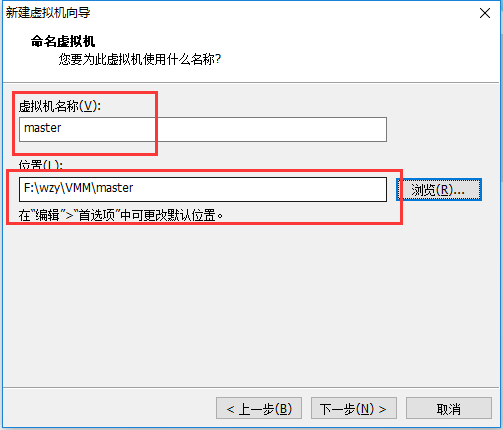

4.设置磁盘容量，磁盘容量先按照给定参数设置，具体大小可以大一点。

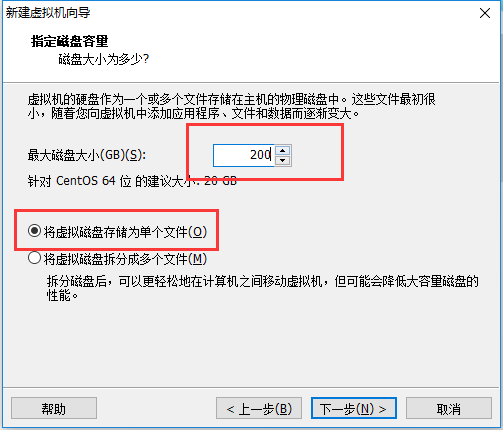

5.如图操作点击完成，可以选择把打印机等设备自行移除

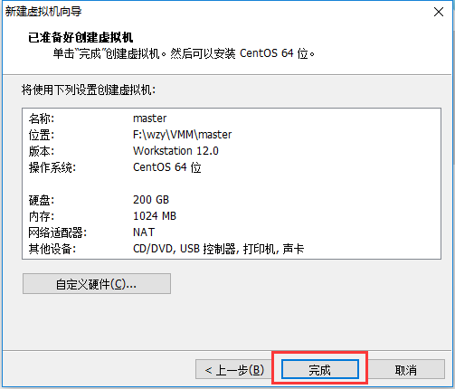

6.进入“虚拟机设置”对话框，选择CentOS镜像文件

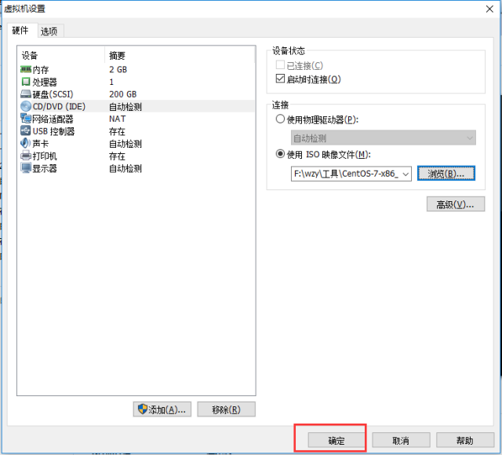

7.开启虚拟机，出现如图界面，点击安装

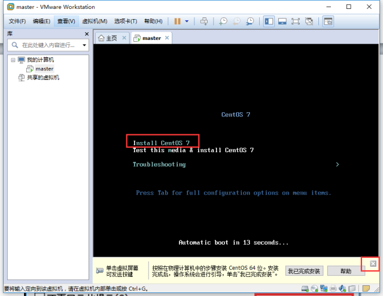

8.选择语言

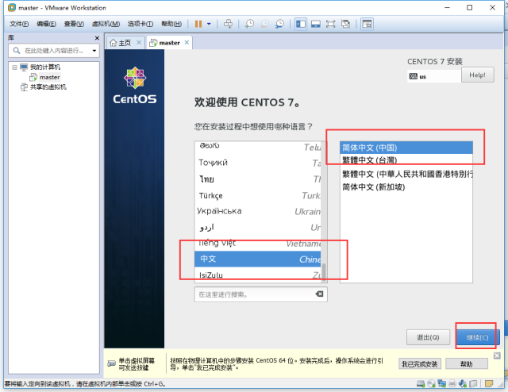

9.选择“安装位置”

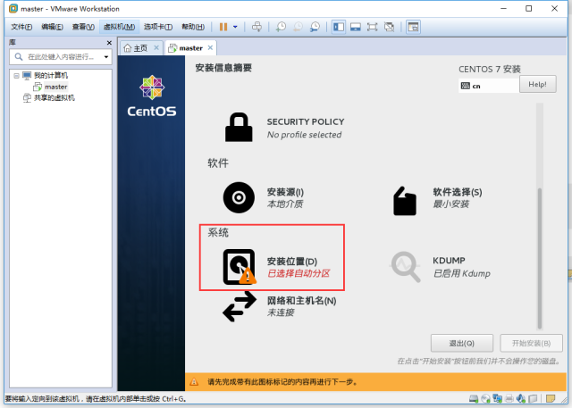

10.进行密码设置

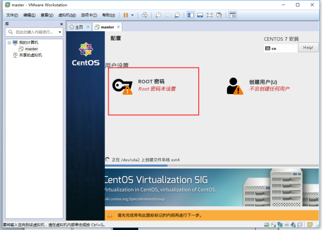

11.等待安装完成，重启进入系统

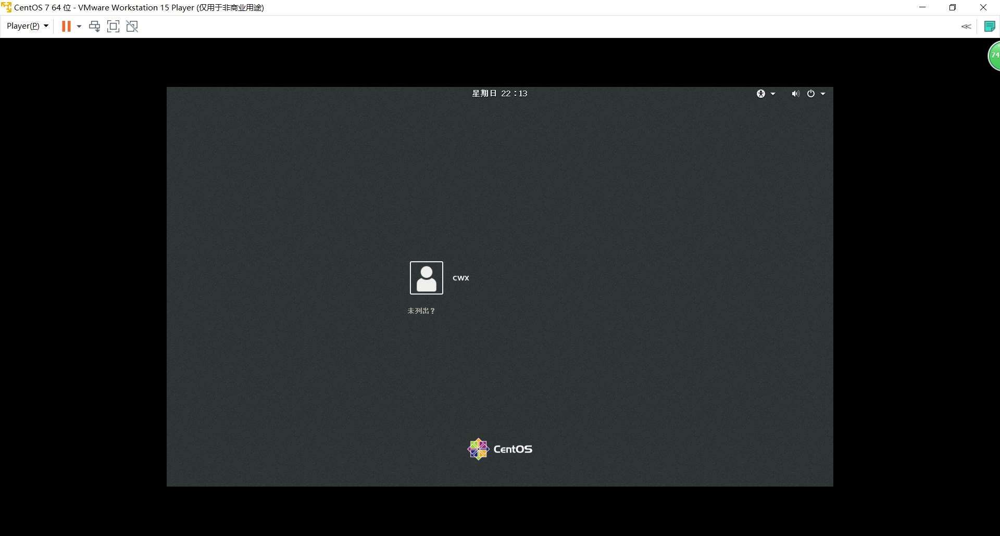