#  Docker基础实验

------


## 一.掌握Docker基础知识

1.Docker的官方网站： 

[https://www.docker.com/](https://www.docker.com/)

 2.了解什么是Docker以及相关的概念和安装： 

https://docs.docker.com/engine/docker-overview/

#### Docker是什么

Docker是一个改进的容器技术。具体的“改进”体现在，Docker为容器引入了镜像，使得容器可以从预先定义好的模版（images）创建出来，并且这个模版还是分层的。

#### Docker经常被提起的特点：

- 轻量，体现在内存占用小，高密度
- 快速，毫秒启动
- 隔离，沙盒技术更像虚拟机

## 二.实验一：安装Docker

在CentOS环境下安装Docker，本实验参考如下教程： 

https://blog.csdn.net/llfjfz/article/details/97964215

#### **1.先决条件**

- 已安装CentOS 7，并且内核版本大等于3.10，本文使用的是腾讯云的镜像：[CentOS镜像](http://mirrors.aliyun.com/centos/7/isos/x86_64/)。
- 非root用户已获得sudo特权。

使用如下命令查看操作系统内核信息：

```
uname -r
```

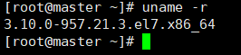

顺带看一下Linux的版本号，使用如下命令：

```
cat /etc/redhat-release
```

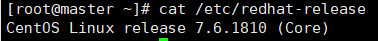

可见腾讯云镜像保存的是CentOS 7.6。
如果当前用户不能使用sudo权限，登录到root用户，在终端键入：

```
gpasswd -a user wheel
```

这里user指代希望授权的用户。该命令将user用户加入“wheel”用户组。在CentOS 7中默认情况下，wheel用户组的用户能够使用sudo命令。

#### **2.安装Docker**

注：本文为了命令的通用性，需要root权限的地方都使用sudo。但其实笔者使用root用户，sudo可以省略。

(1)CentOS 7的应用程序库可能不是最新的，因此首先更新应用程序数据库

```
sudo yum check-update
```

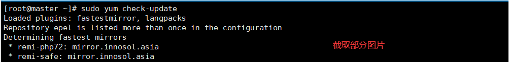

(2)接下来添加Docker的官方仓库，下载最新的Docker并安装：

```
curl -fsSL https://get.docker.com/ | sh
```

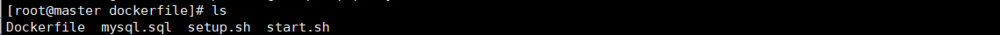“一键”脚本自动安装，但是docker镜像在境外，这个过程非常缓慢，甚至无法完成,本文使用下面的方法安装，那么请参考安装方式：https://www.runoob.com/docker/centos-docker-install.html

（3）安装完成之后启动Docker守护进程，即Docker服务：

```
sudo systemctl start docker
```

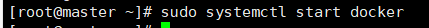

（4）验证Docker是否成功启动：

```
sudo systemctl status docker
```

得到类似如下图的输出：

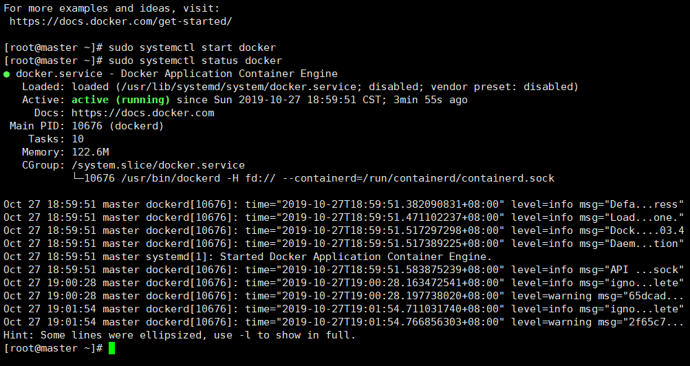

（5）最后，确保Docker当服务器启动时自启动：

```
sudo systemctl enable docker
```

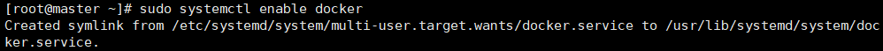

（6）此外，还可以查看一下Docker的版本信息：

```
docker version
```

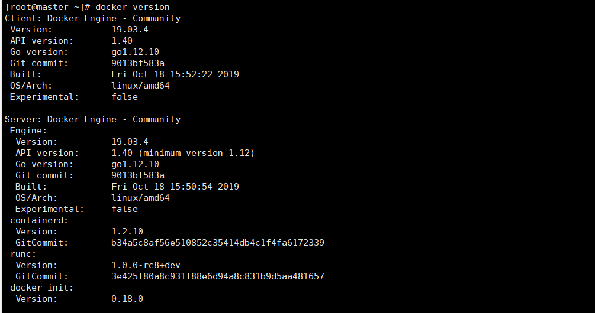

## 三.实验二：完成Docker安装之后加载CentOS镜像

### 1.熟悉Docker的基本操作

#### 容器相关操作

- docker create # 创建一个容器但是不启动它
- docker run # 创建并启动一个容器
- docker stop # 停止容器运行，发送信号SIGTERM
- docker start # 启动一个停止状态的容器
- docker restart # 重启一个容器
- docker rm # 删除一个容器
- docker kill # 发送信号给容器，默认SIGKILL
- docker attach # 连接(进入)到一个正在运行的容器
- docker wait # 阻塞到一个容器，直到容器停止运行

#### 镜像操作

- docker images # 显示本地所有的镜像列表
- docker import # 从一个tar包创建一个镜像，往往和export结合使用
- docker build # 使用Dockerfile创建镜像（推荐）
- docker commit # 从容器创建镜像
- docker rmi # 删除一个镜像
- docker load # 从一个tar包创建一个镜像，和save配合使用
- docker save # 将一个镜像保存为一个tar包，带layers和tag信息
- docker history # 显示生成一个镜像的历史命令
- docker tag # 为镜像起一个别名

###  2. 加载Docker的CentOS镜像

### 参考： ◼ https://blog.csdn.net/llfjfz/article/details/98596243

#### **（1）加载Docker镜像**

拉取官方版本(OFFICIAL)的镜像：

```
docker pull centos
```

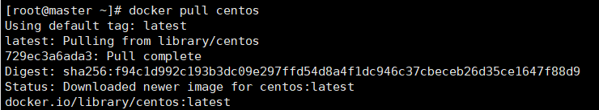

一旦镜像下载完成，可以基于该镜像运行容器，使用run命令：

```
docker run centos
```

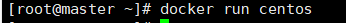

查看一下当前系统中存在的镜像：

```
docker images
```

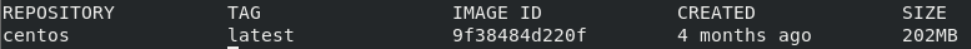

#### **（2）运行Docker容器**

使用-it参数进入交互shell模式：

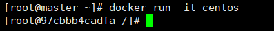

使用exit退出

### 3.在容器实例上完成WordPress的安装

#### **（1）基于cenos：7创建新的镜像**

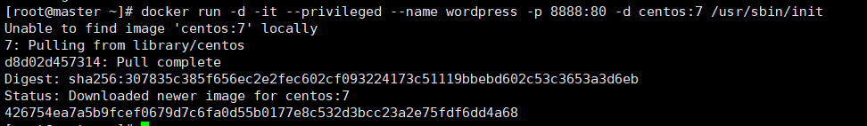

因为在80端口已经搭建了wordpress，所以使用端口映射，将容器的80端口映射到主机的8888端口。使用privileged参数，使container内的root拥有真正的root权限，/usr/sbin/init是为了防止docker的centos镜像把systemctl的功能屏蔽。（此部分感谢CTO指点）

#### （2）查看运行的容器

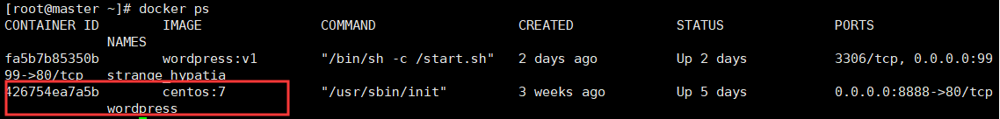

#### （3）进入容器

```
docker exec -it 容器ID /bin/bash
```


#### （4）安装Apache服务并开启服务

使用yum安装

```
sudo yum install httpd
```

开启Apache服务和设置开机自启

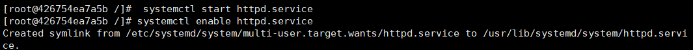

#### （5）安装MySQL

使用yum安装

```
yum install mariadb-server mariadb
```

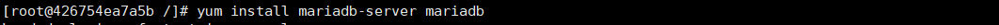启动MariaDB

```
sudo systemctl start mariadb
```

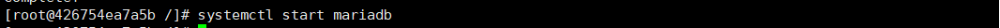设置MySQL的root密码

```
sudo mysql_secure_installation
```

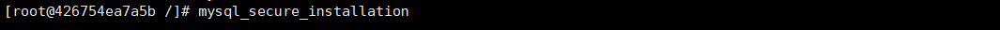设置开机自启MariaDB

```
sudo systemctl enable mariadb.service
```

#### （6）安装PHP

下载

```
 yum install epel-release yum-sudo yum install http://rpms.remirepo.net/enterprise/remi-release-7.rpm
```

更新到7.2版本仓库

```
yum-config-manager --enable remi-php72
```

安装PHP以及php-mysql

```
yum install php php-mysql
```

安装PHP附加模块

```
 yum install php-fpm php-gd
```

#### （7）安装Wordpress

安装WordPress

```
cd ~
wget http://wordpress.org/latest.tar.gz
tar xzvf latest.tar.gz
sudo rsync -avP ~/wordpress/ /var/www/html/
mkdir /var/www/html/wp-content/uploads
sudo chown -R apache:apache /var/www/
```

为WordPress创建一个新的数据库

```
CREATE DATABASE 数据库名 ;
```

进入刚创建的数据库

```
use 数据库名 ;
```

为WordPress创建一个独立的MySQL用户并授权给数据库访问权限

```
CREATE USER 用户名@localhost IDENTIFIED BY '密码';
GRANT ALL PRIVILEGES ON 数据库名.* TO 用户名@localhost IDENTIFIED BY '密码';
```

（8）访问服务器公网IP：映射端口号，验证是否安装成功

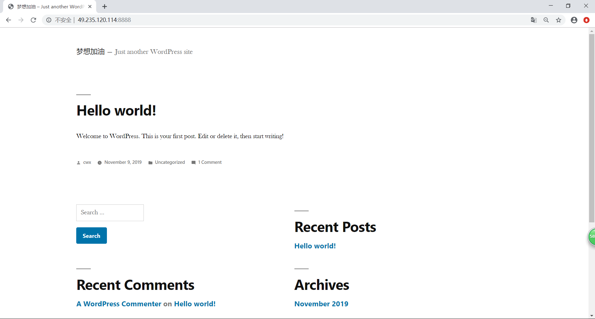

### 4.将安装有WordPress的容器制作成镜像

镜像上传到本地

```
docker commit [OPTIONS] CONTAINER [REPOSITORY[:TAG]]
```

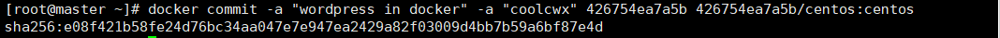

成功生成镜像

```
docker images
```

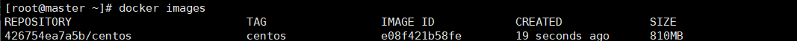

### 5.将镜像推送到dockerhub

接下来要为新建的镜像打上标签（Tag），否则后续推送镜像到Docker Hub的时候将出现“ denied: requested access to the resource is denied”的错误。关于这个错误的解答详见[stackoverflow](https://stackoverflow.com/questions/41984399/denied-requested-access-to-the-resource-is-denied-docker)。

```
docker tag  SOURCE_IMAGE[:TAG] docker-hub-username/REPOSITORY[:TAG]
```

登陆dockerhub

```
docker login -u docker-hub-username
```

输入密码。用户名和密码都正确，随后会显示登录成功。
 使用如下命令推送新创建的镜像：

```
docker push docker-hub-username/docker-image-name
```

登陆Docker Hub，查看Repository，可以看到新上传的镜像。

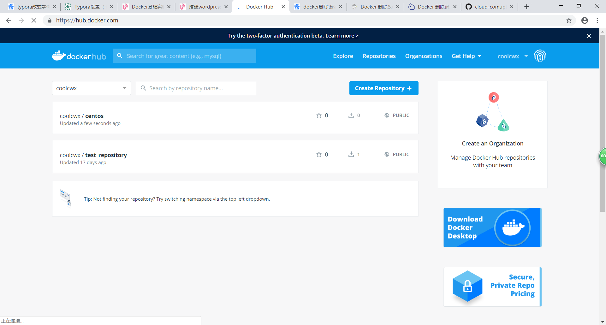


## 四.实验三：利用Dockerfile文件创建包含WordPress的镜像

$$
此次Dockerfile文件中以centos:7为基础镜像，在此基础上进行安装Wordpress
$$

### **构建的原理：**

1、利用Dockerfile进行安装APACHE，PHP和MySQL服务（yum安装或者以rpm包安装（由于网络问题可将需要安装的包下载到本地进行安装））

2、编写shell脚本，将安装好的mariadb进行重新初始化，并启动mariadb，执行需要的sql脚本，初始化数据库数据，最后通过后台开启数据库和APACHE服务。

### 构建的步骤：

（1）整个构建的目录：


目录中有Dockerfile，mysql.sql,setup.sh和start.sh三个文件

（2）下面查看Dockerfile文件，并介绍构建过程执行了什么：

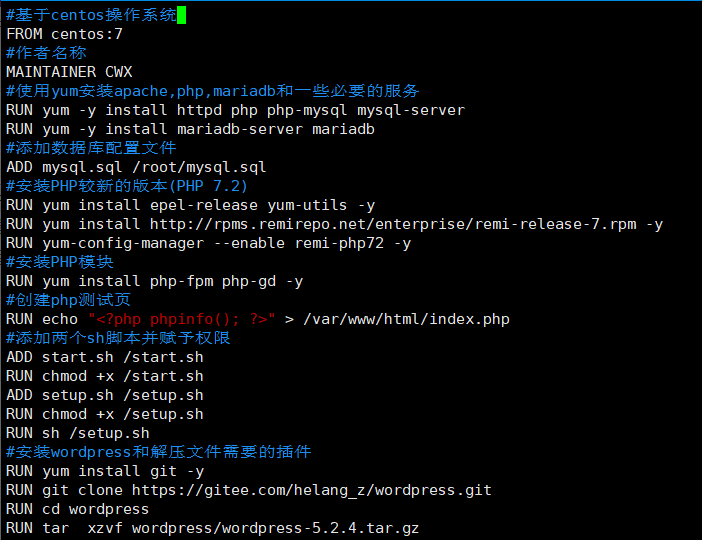

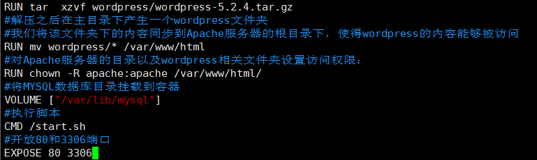

（3）查看setup.sh的内容：

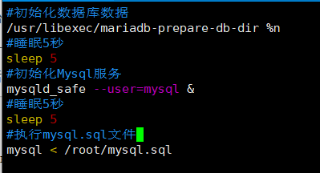

（4）查看start.sh的内容：

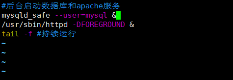

（5）查看mysql.sql的内容：

​              sql内容就是创建的库和设置root账号的密码

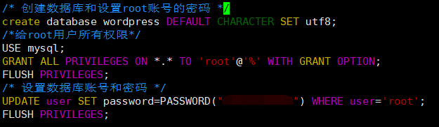

（6）构建镜像：

```
docker build -t wordpress:v1 .
```

  注意：“.”不能遗漏，表示当前目录。

 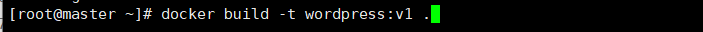

(7)生成容器：

```
docker run -dit -p 9999:80 wordpress:v1
```

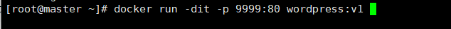

(8)查看启动的容器实例：

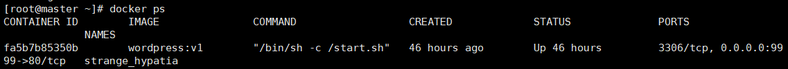

### 验证Wordpress是否安装成功:

最后使用"http://localhost/"进行测试，得到如下结果：

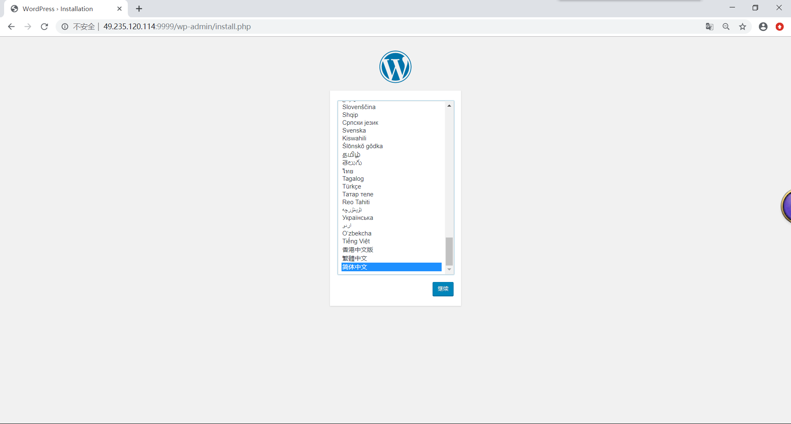


感谢本实验的技术支持人员：HL,YDY