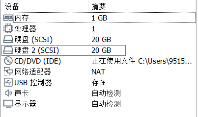
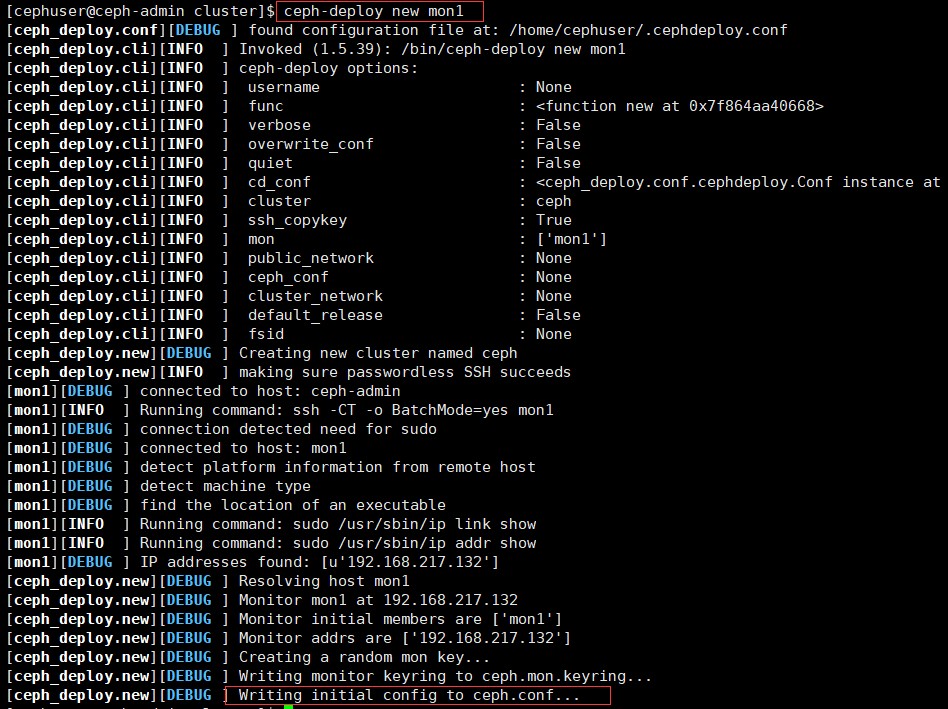
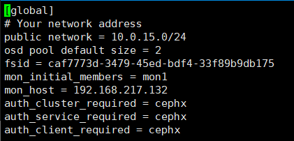
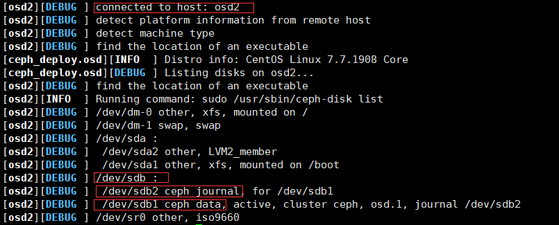
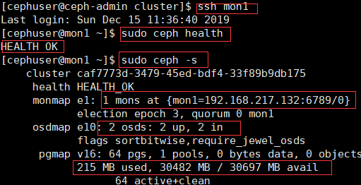

# Ceph的安装与实践

------

Ceph集群需要以下Ceph组件：

- **Ceph OSD（ceph-osd）** -处理数据存储，数据复制和恢复。一个Ceph集群至少需要两个Ceph OSD服务器。我将在这里使用三台CentOS 7 OSD服务器。
- **Ceph Monitor（ceph-mon）** -监视集群状态，OSD映射和CRUSH映射。我将使用一台服务器。
- **Ceph元数据服务器（ceph-mds）** -使用Ceph作为文件系统需要此文件。

------

### **先决条件**

- 4个服务器节点，全部安装了CentOS 7。

- 所有节点上的根特权。

- 给主机改上相应的名字。

  ```
  使用hostnamectl set-hostname xxx进行修改计算机名称
  ```

  重启后即生效。

本教程中的服务器将使用以下主机名和IP地址。

**主机名**    **IP地址**

*ceph-admin 192.168.217.135
mon1 192.168.217.132
osd1 192.168.217.133
osd2 192.168.217.134* 


------

## 步骤1-配置所有节点

在此步骤中，我们将配置所有6个节点，以准备安装Ceph Cluster。您必须在所有节点上遵循并运行下面的所有命令。并确保在所有节点上都安装了ssh-server。

### 创建一个Ceph用户

在所有节点上创建一个名为“ **cephuser** ” 的新用户。

```
useradd -d /home/cephuser -m cephuser
passwd cephuser
```


创建新用户后，我们需要为“ cephuser”配置sudo。他必须能够以root用户身份运行命令，并且无需密码即可获得root用户特权。

运行以下命令为用户创建一个sudoers文件，并使用sed编辑/ etc / sudoers文件。

```
echo "cephuser ALL = (root) NOPASSWD:ALL" | sudo tee /etc/sudoers.d/cephuser
chmod 0440 /etc/sudoers.d/cephuser
sed -i s'/Defaults requiretty/#Defaults requiretty'/g /etc/sudoers
```


### 安装和配置NTP

安装NTP以同步所有节点上的日期和时间。运行ntpdate命令通过NTP协议设置日期和时间，我们将使用us pool NTP服务器。然后启动并启用NTP服务器在引导时运行。

```
yum install -y ntp ntpdate 
ntp-docntpdate 0.us.pool.ntp.org
hwclock --systohc
systemctl enable ntpd.service
systemctl start ntpd.service
```

### 安装Open-vm-tools

如果要在VMware内部运行所有节点，则需要安装此虚拟化实用程序。否则，请跳过此步骤。

```
yum install -y open-vm-tools
```


### 禁用SELinux

通过使用sed流编辑器编辑SELinux配置文件，在所有节点上禁用SELinux。

```
sed -i 's/SELINUX=enforcing/SELINUX=disabled/g' /etc/selinux/config
```


### 配置主机文件

使用vim编辑器在所有节点上编辑/ etc / hosts文件，并添加带有所有集群节点的IP地址和主机名的行。

```
vim /etc/hosts
```

粘贴以下配置：

192.168.217.135          ceph-admin 
192.168.217.132          mon1
192.168.217.133          osd1
192.168.217.134          osd2

保存文件并退出vim。

现在，您可以尝试使用主机名在服务器之间ping通，以测试网络连接。例：

```
ping -c 5 mon1
```

其中5是发送的包的数量，mon1是节点名称，要确保要ping的虚拟机有启动。


------

## 第2步-配置SSH服务器

在此步骤中，我将配置**ceph-admin节点**。admin节点用于配置监视节点和osd节点。登录到**ceph** -admin节点并成为“ **cephuser** ”。

```
ssh root@ceph-admin
su - cephuser
```

admin节点用于安装和配置所有群集节点，因此ceph-admin节点上的用户必须具有无需密码即可连接到所有节点的特权。我们必须在“ ceph-admin”节点上为“ cephuser”配置无密码的SSH访问。


为“ **cephuser** ” 生成ssh密钥。

```
ssh-keygen
```


将密码短语留空/空白。

接下来，为ssh配置创建配置文件。

```
vim ~/.ssh/config
```

粘贴以下配置：

```
Host ceph-admin      
                Hostname ceph-admin     
                User cephuser
Host mon1        
                Hostname mon1        
                User cephuser 
Host osd1       
                Hostname osd1        
                User cephuser 
Host osd2        
                Hostname osd2      
                User cephuser
```


保存文件。

更改配置文件的权限。

```
chmod 644 ~/.ssh/config
```

现在，使用ssh-copy-id命令将SSH密钥添加到所有节点。

```
ssh-keyscan osd1 osd2  mon1 >> ~/.ssh/known_hosts
ssh-copy-id osd1
ssh-copy-id osd2
ssh-copy-id mon1
```


根据要求输入您的“ cephuser”密码。osd2，mon1类似。


完成后，请尝试从ceph-admin节点访问osd1服务器。

```
ssh osd1
```


logout退出ssh连接。

------

## 步骤3-配置防火墙

我们将使用防火墙保护系统。在此步骤中，我们将在所有节点上启用firewald，然后打开ceph-admon，ceph-mon和ceph-osd所需的端口。

登录到ceph-admin节点并启动firewalld。

```
ssh root@ceph-admin
systemctl start firewalld
systemctl enable firewalld
```


打开端口80、2003和4505-4506，然后重新加载防火墙。

```
sudo firewall-cmd --zone=public --add-port=80/tcp --permanent
sudo firewall-cmd --zone=public --add-port=2003/tcp --permanent
sudo firewall-cmd --zone=public --add-port=4505-4506/tcp --permanentsudo firewall-cmd --reload
```


从ceph-admin节点登录到监视节点“ mon1”，然后启动firewalld。

```
ssh mon1
sudo systemctl start firewalld
sudo systemctl enable firewalld
```


在Ceph监视节点上打开新端口，然后重新加载防火墙。

```
sudo firewall-cmd --zone=public --add-port=6789/tcp --permanent
sudo firewall-cmd --reload
```


最后，打开每个osd节点上的端口6800-7300-osd1，osd2和os3。

从ceph-admin节点登录到每个osd节点。

```
ssh osd1
sudo systemctl start firewalld
sudo systemctl enable firewalld
```

打开端口并重新加载防火墙。

```
sudo firewall-cmd --zone=public --add-port=6800-7300/tcp --permanent
sudo firewall-cmd --reload
```


osd2与osd1一致。

防火墙配置完成。

------

## 步骤4-配置Ceph OSD节点

在本教程中，我们有3个OSD节点，每个节点有两个分区。

1. **/ dev / sda**用于根分区。
2. **/ dev / sdb**是一个空分区-在我的情况下为30GB。

我们将**/ dev / sdb**用于Ceph磁盘。从ceph-admin节点登录到所有OSD节点，并使用**XFS**格式化/ dev / sdb分区 。

在osd的虚拟机设置中添加一个硬盘作为/dev/sdb分区。



```
ssh osd1
ssh osd2
```

使用fdisk命令检查分区。

```
sudo fdisk -l /dev/sdb
```


使用parted命令，使用XFS文件系统和GPT分区表格式化/ dev / sdb分区。

```
sudo parted -s /dev/sdb mklabel gpt mkpart primary xfs 0% 100%
sudo mkfs.xfs /dev/sdb -f
```


现在检查分区，您将获得xfs / dev / sdb分区。

```
sudo blkid -o value -s TYPE /dev/sdb
```


## 第5步-构建Ceph集群

在这一步中，我们将在ceph-admin节点的所有节点上安装Ceph。

登录到ceph-admin节点。

```
ssh root@ceph-admin
su - cephuser
```


### 在ceph-admin节点上安装ceph-deploy

添加Ceph存储库，并使用yum命令安装Ceph部署工具' **ceph-deploy** '。

```
sudo rpm -Uhv http://download.ceph.com/rpm-jewel/el7/noarch/ceph-release-1-1.el7.noarch.rpm
sudo yum update -y && sudo yum install ceph-deploy -y
```


确保所有节点都已更新。

安装ceph-deploy工具后，为ceph集群配置创建一个新目录。

### 创建新的集群配置

创建新的群集目录。

```
mkdir cluster
cd cluster/
```

接下来，使用“ **ceph** **-deploy** ”命令创建一个新的集群配置，将监视节点定义为“ **mon1** ”。

```
ceph-deploy new mon1
```

该命令将在集群目录中生成Ceph集群配置文件'ceph.conf'。



用vim编辑ceph.conf文件。

```
vim ceph.conf
```

在[global]块下，在下面粘贴配置。

```
# Your network address
public network = 10.0.15.0/24
osd pool default size = 2
```

保存文件并退出vim。



### 在所有节点上安装Ceph

现在，从ceph-admin节点在所有其他节点上安装Ceph。这可以通过单个命令完成。

```
ceph-deploy install ceph-admin mon1 osd1 osd2 osd3
```

该命令将在所有节点上自动安装Ceph：mon1，osd1-3和ceph-admin-安装将花费一些时间。

如果超时，可以单独在各自节点上安装。

现在将ceph-mon部署在mon1节点上。

```
ceph-deploy mon create-initial
```


该命令将创建监视键，并使用“ ceph”命令检查并获取键。

```
ceph-deploy gatherkeys mon1
```


### 将OSDS添加到群集

在所有节点上都安装了Ceph之后，我们可以将OSD守护程序添加到集群中。OSD守护程序将在磁盘/ dev / sdb上创建其数据和日志分区。

检查/ dev / sdb分区在所有OSD节点上是否可用。

```
ceph-deploy disk list osd1 osd2
```


您将看到具有XFS格式的/ dev / sdb磁盘。

接下来，使用zap选项删除所有节点上的/ dev / sdb分区表。

```
ceph-deploy disk zap osd1:/dev/sdb osd2:/dev/sdb osd3:/dev/sdb
```


使用以下命令激活OSD：

```
ceph-deploy osd activate osd1:/dev/sdb1 osd2:/dev/sdb1 
```

在继续之前，请检查输出是否有错误。现在，您可以使用list命令检查OSD节点上的sdb磁盘。

```
ceph-deploy disk list osd1 osd2 
```



结果是/ dev / sdb现在具有两个分区：

1. **/ dev / sdb1** -Ceph数据
2. **/ dev / sdb2** -Ceph日记

或者，您可以直接使用fdisk在OSD节点上进行检查。

```
ssh osd1
sudo fdisk -l /dev/sdb
```


接下来，将管理密钥部署到所有关联的节点。

```
ceph-deploy admin ceph-admin mon1 osd1 osd2 
```

通过在所有节点上运行以下命令来更改密钥文件的权限。

```
sudo chmod 644 /etc/ceph/ceph.client.admin.keyring
```

在CentOS 7上的Ceph集群已创建。

## 第6步-测试Ceph设置

在第4步中，我们安装并创建了新的Ceph集群，然后将OSDS节点添加到了集群中。现在我们可以测试集群，并确保集群设置中没有错误。

从**ceph** -admin节点登录到**ceph**监视服务器“ **mon1** ”。

```
ssh mon1
```

运行以下命令以检查集群运行状况。

```
sudo ceph health
```

现在检查集群状态。

```
sudo ceph -s
```

并且您应该看到以下结果：



确保Ceph运行状况**正常，**并且有一个监视节点“ **mon1** ”，其IP地址为“ **10.0.15.11** ”。应该有 **3个OSD**服务器，并且所有服务器都应该都已 **启动**并正在运行，并且应该有大约**75GB**的可用磁盘 -3x25GB的Ceph数据分区。

恭喜，您已经成功构建了一个新的Ceph集群。


参考自：https://www.howtoforge.com/tutorial/how-to-build-a-ceph-cluster-on-centos-7/#install-cephdeploy-on-the-cephadmin-node